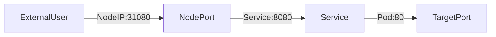

尽管微服务驱动架构旨在解耦应用程序的组件，但微服务仍然需要代理来逻辑地将它们绑定或分组在一起以用于管理目的，或者将流量负载平衡到属于此类逻辑集的组件上。

在本章中，我们将学习用于抽象集群内部微服务之间或与外部世界的通信的服务对象。服务为 Kubernetes 集群管理的无状态容器化应用程序提供单一 DNS 条目，无论其副本数量多少，它都通过为一组由控制器（例如 Deployment、ReplicaSet 或 DaemonSet）按逻辑分组和管理的 Pod 提供通用的负载均衡访问点。

我们还将了解 kube-proxy 守护进程，它在每个控制平面和工作节点上运行，用于实现服务的配置并提供对服务的访问。此外，我们还将讨论服务发现和服务类型，它们决定了服务的访问范围。

By the end of this chapter, you should be able to:
- Discuss the benefits of logically grouping Pods with Services to access an application.
- Explain the role of the **kube-proxy** daemon running on each node.
- Explore the Service discovery options available in Kubernetes.
- Discuss different Service types.

# Accessing Application Pods
举个例子，一个操作员管理一组 Pod，而一个用户/客户端直接使用 Pod 各自的 IP 地址访问它们。这种访问方式需要客户端提前获取目标 Pod 的 IP 地址，这会给客户端带来不必要的开销。
![[Pasted image 20250513123349.png]]
意外地，用户/客户端正在访问的其中一个 Pod 被终止，控制器会创建一个新的 Pod。新的 Pod 将被分配一个新的 IP 地址，而用户/客户端不会立即知道该 IP 地址。如果客户端试图监视目标 Pod 的 IP 地址是否有任何更改和更新，这将导致一种低效的方法，只会增加客户端的开销。

To overcome this situation, k8s provides a higher-level abstraction called **Service**, which logically groups Pods and defines a policy to access them. This grouping is acieved via **Labels** and **Selectors**. This logical grouping strategy is used by Pod controllers, such as ReplicaSets, Deployments, and even DaemonSets.

# Services
Labels and Selectors use a **key-value** pair format. In the following graphical representation, **app** is the Label **key**, **frontend** and **db** are Label **values** for different Pods.
![[Pasted image 20250513123931.png]]  **Grouping of Pods using Labels and Selectors**

we group Pods into two logical sets: one set with 3 Pods, and one set with a single Pod.

We assign a name to the logical grouping, referred to as a **Service**. The Service name is also registered with the cluster's internal DNS service. In our example, we create two Services, **frontend-svc**, and **db-svc**, and they have the **app== frontend** and the **app== db** Selectors, respectively.

服务可以公开单个 Pod、ReplicaSet、Deployment、DaemonSet 和 StatefulSet。When exposing the Pods managed by an operator, the Service's Selector may use the same label(s) as the operator. A clear benefit of a Service is that it watches application Pods for any changes in count and their respective IP addresses while automatically updating the list of corresponding endpoints. Even for a single-replica application, run by a single Pod, the Service is beneficial during self-healing (replacement of a failed Pod) as it immediately directs traffic to the newly deployed healthy Pod.

Imperatively, we can use a direct method to expose the Deploymen’s Pods. The following is a multi-line command that should be selected in its entirety for copy/paste (including the backslash character “\”):

**$ kubectl expose deploy frontend --name=frontend-svc \  
--port=80 --target-port=5000**

这条命令：

```bash
kubectl expose deploy frontend --name=frontend-svc \
--port=80 --target-port=5000
```

的作用是：为名为 `frontend` 的 Deployment 创建一个名为 `frontend-svc` 的 **Service**，使外部或集群内部可以通过端口访问它的 Pod。

---

## 🎯 `--port` 和 `--target-port` 的区别

|字段|作用|
|---|---|
|`--port`|Service 对外暴露的端口（客户端访问 Service 用的端口）|
|`--target-port`|Pod 中容器实际监听的端口（容器内服务运行的端口）|

---

### ✅ 图解理解

```
[Client] ---> Service (port: 80) ---> Pod (targetPort: 5000)
```

也就是说：

- 你访问 `frontend-svc:80`
    
- 它会被 Kubernetes 的 Service 转发到 Pod 的端口 `5000`
    
- `5000` 是容器中运行的 Web 服务监听的端口

在此示例中，我们通过选择所有将标签 key=app 设置为 value=frontend 的 Pod 来创建 frontend-svc 服务。默认情况下，每个服务都会收到一个仅在集群内部可路由的 IP 地址，称为 ClusterIP。在我们的示例中，我们分别将 172.17.0.4 和 172.17.0.5 作为 ClusterIP 分配给了 frontend-svc 和 db-svc 服务。
![[Pasted image 20250513124926.png]]
用户/客户端现在通过 ClusterIP 连接到 Service，该 Service 将流量转发到与其关联的 Pod 之一。Service 在选择用于流量转发的 Pod 时默认提供负载均衡。

当服务将流量转发到 Pod 时，我们可以选择接收流量的 Pod 上的 targetPort。在我们的示例中，frontend-svc 服务通过端口 80 接收来自用户/客户端的请求，然后将这些请求转发到 targetPort 5000 上已连接的 Pod 之一。如果未明确定义 targetPort，则流量将被转发到服务接收流量的端口上的 Pod——在这种情况下，targetPort 的值会被隐式赋值。务必确保 targetPort 的值（本例中为 5000）与 Pod spec 部分中 containerPort 属性的值匹配。

A logical set of a Pod's IP address, along with the **targetPort** is referred to as a **Service endpoint**. In our example, the **frontend-svc** Service has 3 endpoints: **10.0.1.3:5000**, **10.0.1.4:5000**, and **10.0.1.5:5000** respectively. Endpoints are created and managed automatically by the Service, not by the Kubernetes cluster administrators or developers.

# kube-proxy
每个集群节点都运行一个名为 > 的守护进程，它是一个节点代理，负责监视控制平面节点上的 API 服务器，以了解服务和端点的添加、更新和删除情况。kube-proxy 负责代表管理员或开发人员实现服务配置，以便将流量路由到 Pod 中运行的公开应用程序。在下面的示例中，对于每个新服务，在每个节点上，kube-proxy 都会配置 iptables 规则以捕获其 ClusterIP 的流量并将其转发到该服务的某个端点。因此，任何节点都可以接收外部流量，然后根据 iptables 规则在集群内部进行路由。当服务被删除时，kube-proxy 也会删除所有节点上相应的 iptables 规则。

正如 kube-proxy 节点代理在每个集群节点上冗余运行一样，iptables 也由各自的节点代理以冗余方式填充，以便每个 iptables 实例都存储整个集群的完整路由规则。这有助于 Service 对象实现重现分布式负载均衡机制。

在 Kubernetes 中，`kube-proxy` 和 `Service` 是紧密相关的两个概念，但它们的角色和功能有显著区别：

---

### 1. **Service**
- **作用**：  
  Service 是 Kubernetes 的一种抽象资源，用于定义一组 Pod 的逻辑集合和访问策略。它的核心功能是：
  - 为 Pod 提供稳定的 IP 地址（ClusterIP）和 DNS 名称。
  - 负载均衡：将请求分发到后端的多个 Pod。
  - 服务发现：允许其他服务通过名称或 IP 访问后端 Pod，无需关心 Pod 的具体位置。

- **类型**：  
  - ClusterIP（默认）：集群内部访问。
  - NodePort：通过节点端口暴露服务。
  - LoadBalancer：通过云提供商的负载均衡器暴露服务。
  - ExternalName：映射到外部服务（如数据库）。

- **示例**：  
  定义一个 Service 会生成一个虚拟 IP（VIP），流量会被自动转发到匹配标签的 Pod。

---

### 2. **kube-proxy**
- **作用**：  
  `kube-proxy` 是运行在每个节点上的守护进程，负责实现 Service 的流量转发规则。它是 Service 功能的实际执行者，具体工作包括：
  - 监听 API Server 的 Service 和 Endpoint 变化。
  - 配置节点上的网络规则（如 iptables/IPVS），确保发往 Service VIP 的流量被正确路由到后端 Pod。
  - 支持多种代理模式：`iptables`（默认）、`IPVS`、`userspace`（已弃用））。

- **关键区别**：  
  - Service 是逻辑抽象，而 `kube-proxy` 是实现这一抽象的底层组件。
  - 没有 `kube-proxy`，Service 的流量转发功能无法正常工作。

---

### 对比总结
| 特性               | Service                          | kube-proxy                      |
|--------------------|----------------------------------|---------------------------------|
| **角色**           | 逻辑抽象（定义访问策略）         | 网络代理（实现流量转发）        |
| **配置方式**       | 通过 YAML 声明                   | 自动监听 Service/Endpoint 变化  |
| **依赖关系**       | 依赖 `kube-proxy` 实现功能       | 依赖 Service 提供转发目标       |
| **层级**           | 用户-facing 资源                 | 节点级后台进程                 |

---

### 协作流程
1. 用户创建 Service，指定 Pod 选择器（如 `app: nginx`）。
2. `kube-proxy` 检测到 Service 变化，更新节点的 iptables/IPVS 规则。
3. 当流量到达 Service VIP 时，`kube-proxy` 的规则将其转发到实际 Pod。

# Traffic Policies
当流量路由到应用程序端点时，kube-proxy 节点代理与 iptables 共同实现服务的负载均衡机制。由于 iptables 的限制特性，此负载均衡默认是随机的。这意味着接收服务转发请求的端点 Pod 将从众多副本中随机选择。此机制无法保证所选的接收 Pod 与请求者距离最近，甚至无法保证其位于同一节点，因此并非最高效的机制。由于这是 iptables 支持的负载均衡机制，如果我们想要获得更好的结果，则需要利用流量策略。

流量策略允许用户指示 kube-proxy 的流量路由上下文。有两个选项：集群和本地：

Cluster 选项允许 kube-proxy 在负载均衡过程中定位服务所有就绪的 Endpoint。即使未明确声明流量策略属性，这也是服务的默认行为。

然而，Local 选项会隔离负载均衡过程，使其仅包含与请求者 Pod 位于同一节点的服务 Endpoint，或者可能包含在其 NodePort 上捕获入站外部流量的节点的服务 Endpoint（NodePort 服务类型将在后续课程中介绍）。虽然这听起来像是一个理想的选择，但它确实有一个缺点——如果服务在运行请求者 Pod 的节点上没有就绪的 Endpoint，则服务将不会将请求路由到其他节点上的 Endpoint 来满足该请求，因为它会被 kube-proxy 丢弃。

在 Kubernetes 中，**Traffic Policies（流量策略）** 允许用户通过 `kube-proxy` 控制流量的路由范围，主要分为两种模式：`Cluster`（集群范围）和 `Local`（本地节点）。以下是它们的核心区别和实际影响：

---

### 1. **Cluster 模式（默认）**
- **行为**：  
  - `kube-proxy` 会将流量负载均衡到该 Service 的所有可用后端 Pod（即所有 `Ready` 状态的 Endpoints），**无论这些 Pod 分布在哪个节点上**。
  - 这是 Service 的默认行为，即使未显式声明 `trafficPolicy` 也会生效。

- **优点**：  
  - 最大化利用集群资源，避免因局部 Pod 不可用导致请求失败。
  - 适合大多数场景，尤其是无状态服务。

- **示例**：  
  如果一个 Service 有 3 个 Pod 分布在 NodeA、NodeB、NodeC 上，来自任何节点的请求都可能被转发到任意一个 Pod。

---

### 2. **Local 模式**
- **行为**：  
  - `kube-proxy` 仅将流量路由到**与请求来源在同一节点上的后端 Pod**。  
    - 对于 **Pod-to-Service** 流量：请求方 Pod 所在的节点必须有该 Service 的可用 Endpoint。  
    - 对于 **外部流量（如 NodePort）**：流量到达的节点必须有该 Service 的可用 Endpoint。  
  - 如果当前节点没有可用 Endpoint，请求会被直接丢弃（返回错误，如 `Connection refused`）。

- **优点**：  
  - 避免跨节点网络跳转，降低延迟和网络开销。  
  - 保留请求的原始客户端 IP（不经过 SNAT），适合需要客户端 IP 的应用（如日志、鉴权）。  

- **缺点**：  
  - **可能导致流量不均**：如果某些节点没有后端 Pod，这些节点上的请求会失败。  
  - **需配合 Pod 拓扑分布**：通常需要设置 `podAntiAffinity` 或 `topologySpreadConstraints` 确保 Pod 均匀分布。

- **适用场景**：  
  - 需要保留客户端 IP 的服务（如 Ingress 控制器）。  
  - 对网络延迟敏感的应用（如高性能计算）。  

---

### 关键对比
| 特性                | Cluster 模式                     | Local 模式                        |
|---------------------|----------------------------------|-----------------------------------|
| **路由范围**        | 集群内所有 Ready 的 Endpoints    | 仅当前节点的 Endpoints            |
| **客户端 IP**       | 可能被 SNAT 隐藏（跨节点时）     | 保留原始客户端 IP                 |
| **容错性**          | 高（自动故障转移）               | 低（依赖本地 Pod 可用性）         |
| **典型用例**        | 通用无状态服务                   | NodePort/LoadBalancer + 客户端 IP |

---

### 配置示例
```yaml
apiVersion: v1
kind: Service
metadata:
  name: my-service
spec:
  selector:
    app: my-app
  ports:
    - protocol: TCP
      port: 80
      targetPort: 9376
  externalTrafficPolicy: Local  # 显式设置为 Local 模式
```

---

### 注意事项
1. **Local 模式的陷阱**：  
   - 如果 Pod 集中在少数节点，其他节点的请求会失败。需确保 Pod 分布均匀（例如通过 `topologySpreadConstraints`）。  
   - 对于 `NodePort` 服务，外部流量可能被路由到没有后端 Pod 的节点，导致连接被拒绝。

2. **性能权衡**：  
   - Cluster 模式可能引入跨节点流量，但容错性更好。  
   - Local 模式减少网络跳转，但需牺牲部分可用性。

集群和本地选项均适用于集群内部生成的请求，或集群外部运行的应用程序和客户端生成的请求。下方的服务定义清单定义了内部和外部本地流量策略。两者均为可选设置，可以独立使用，其中之一可以独立于另一个（内部或外部策略）进行定义。

**apiVersion: v1  
kind: Service  
metadata:  
  name: frontend-svc  
spec:  
  selector:  
    app: frontend  
  ports:  
    - protocol: TCP  
      port: 80  
      targetPort: 5000  
  internalTrafficPolicy: Local  
  externalTrafficPolicy: Local**

# Service Discovery
As Services are the primary mode of communication between containerized applications managed by Kubernetes, it is helpful to be able to discover them at runtime. k8s supports two methods for discovering Services:

## Environment Variables
一旦 Pod 在任何工作节点上启动，the **kubelet** daemon running on that node adds a set of environment variables in the Pod for all active Services. 例如，如果我们有一个名为 redis-master 的活动服务，它公开端口 6379，其 ClusterIP 为 172.17.0.6，那么在新创建的 Pod 上，我们可以看到以下环境变量：

**REDIS_MASTER_SERVICE_HOST=172.17.0.6**  
**REDIS_MASTER_SERVICE_PORT=6379**  
**REDIS_MASTER_PORT=tcp://172.17.0.6:6379**  
**REDIS_MASTER_PORT_6379_TCP=tcp://172.17.0.6:6379**  
**REDIS_MASTER_PORT_6379_TCP_PROTO=tcp**  
**REDIS_MASTER_PORT_6379_TCP_PORT=6379**  
**REDIS_MASTER_PORT_6379_TCP_ADDR=172.17.0.6**

使用此解决方案，我们在订购服务时需要小心，因为 Pod 不会为在创建 Pod 之后创建的服务设置环境变量。

## DNS
Kubernetes has an add-on for [DNS](https://kubernetes.io/docs/concepts/services-networking/dns-pod-service/), which creates a DNS record for each Service and its format is **my-svc.my-namespace.svc.cluster.local**. Services within the same Namespace find other Services just by their names. If we add a Service **redis-master** in ;**my-ns** Namespace, all Pods in the same **my-ns** Namespace lookup the Service just by its name, **redis-master**. 来自其他命名空间（例如 test-ns）的 Pod 通过添加相应的命名空间作为后缀（例如 redis-master.my-ns）或提供服务的 FQDN 作为 redis-master.my-ns.svc.cluster.local）来查找相同的服务。

如果我们有一个客户端应用程序访问前端应用程序，那么客户端只需要“知道”前端应用程序的服务名称和端口，分别是 frontend-svc 和端口 80。我们可以从客户端应用程序 Pod 运行以下命令，允许集群内部名称解析和 kube-proxy 将客户端的请求引导到前端 Pod：

**$ kubectl exec client-app-pod-name -c client-container-name -- /bin/sh -c curl -s frontend-svc:80**

这个命令用于在 Kubernetes 集群中从一个 Pod 内部向另一个 Service 发起 HTTP 请求，以下是逐部分解析：

---

### 命令结构
```bash
kubectl exec <pod-name> -c <container-name> -- /bin/sh -c "curl -s <service>:<port>"
```

| 部分 | 作用 |
|------|------|
| `kubectl exec` | 在指定 Pod 中执行命令 |
| `<client-app-pod-name>` | **源 Pod** 的名称（发起请求的 Pod） |
| `-c <client-container-name>` | 指定 Pod 中的容器名（若 Pod 多容器） |
| `-- /bin/sh -c` | 启动 Shell 并执行后续命令 |
| `curl -s frontend-svc:80` | 向 Service `frontend-svc` 的 80 端口发起静默（`-s`）HTTP 请求 |

---

### 关键细节
1. **Service 发现机制**：  
   - `frontend-svc:80` 利用了 Kubernetes 的 DNS 服务发现：  
     - `frontend-svc` 会被解析为 Service 的 ClusterIP（虚拟 IP）。  
     - `kube-proxy` 负责将请求负载均衡到后端 Pod。

2. **跨命名空间**：  
   - 如果 `frontend-svc` 在其他命名空间，需使用全限定名称：`frontend-svc.<namespace>.svc.cluster.local:80`。

3. **容器内执行**：  
   - 该命令模拟了 **Pod-to-Service** 的通信场景，常用于调试服务连通性或验证网络策略。

4. **静默模式（`-s`）**：  
   - `curl -s` 隐藏进度条和错误信息，仅输出响应内容（适合脚本调用）。

---

### 常见问题排查
- **连接失败**：  
  - 检查 `frontend-svc` 是否存在且端口正确：  
    ```bash
    kubectl get svc frontend-svc
    ```
  - 确认后端 Pod 是否 Ready：  
    ```bash
    kubectl get endpoints frontend-svc
    ```

- **容器无 `curl`**：  
  若容器内无 `curl`，可改用 `wget` 或临时安装：  
  ```bash
  kubectl exec <pod> -- /bin/sh -c "apk add curl && curl -s frontend-svc:80"
  ```

# ServiceType
While defining a Service, we can also choose its access scope. We can decide whether the Service:

- Is only accessible within the cluster.
- Is accessible from within the cluster and the external world.
- Maps to an entity which resides either inside or outside the cluster.
映射到位于集群内部或外部的实体。

Access scope is decided by **ServiceType** property, defined when creating the Service.

使用 NodePort ServiceType，除了 ClusterIP 之外，还会从所有工作节点上动态选择一个高端口号（默认范围 30000-32767）映射到相应的服务。例如，如果服务 frontend-svc 的映射 NodePort 为 32233，那么当我们连接到端口 32233 上的任何工作节点时，该节点会将所有流量重定向到分配的 ClusterIP - 172.17.0.4。如果我们更喜欢使用特定的高端口号，则可以在创建服务时将该高端口号从默认范围中分配给 NodePort。
![[Pasted image 20250513201934.png]]
The **NodePort** _ServiceType_ is useful when we want to make our Services accessible from the external world. The end-user connects to any worker node on the specified high-port, which proxies the request internally to the ClusterIP of the Service, then the request is forwarded to the applications running inside the cluster. 别忘了，服务会对这些请求进行负载均衡，并且只会将请求转发到运行所需应用程序的 Pod 之一。为了管理外部对多个应用服务的访问，管理员可以配置反向代理（即 Ingress），并定义针对集群内特定服务的规则。

NodePort 类型必须在服务定义清单中显式声明，或者使用上一课中探讨过的命令式方法——expose 和 create service 命令。声明 nodePort 值 32233 是可选的，但需确保不发生冲突。我们重用之前针对 NodePort 类型更新的定义和命令，并在支持的情况下声明 nodePort 值：

**apiVersion: v1  
kind: Service  
metadata:  
  name: frontend-svc  
spec:  
  selector:  
    app: frontend  
  ports:  
  - protocol: TCP  
    port: 80  
    targetPort: 5000  
    nodePort: 32233  
  type: NodePort**

**$ kubectl expose deploy frontend --name=frontend-svc \  
--port=80 --target-port=5000 --type=NodePort** 

**$ kubectl create service nodeport frontend-svc \  
--tcp=80:5000 --node-port=32233**


## LoadBalancer
With the **[LoadBalancer](https://kubernetes.io/docs/concepts/services-networking/service/#loadbalancer)** _ServiceType_:

- NodePort and ClusterIP are automatically created, and the external load balancer will route to them.
- The Service is exposed at a static port on each worker node.
- The Service is exposed externally using the underlying cloud provider's load balancer feature.
![[Pasted image 20250513202849.png]]
LoadBalancer 服务类型仅在底层基础架构支持自动创建负载均衡器并在 Kubernetes 中提供相应支持（例如 Google Cloud Platform 和 AWS）时才有效。如果未配置此功能，则不会填充 LoadBalancer 的 IP 地址字段，该服务将保持待处理状态，但该服务仍将作为典型的 NodePort 类型服务运行。

## ExternalIP
如果服务可以路由到一个或多个工作节点，则可以将其映射到外部 IP 地址。通过服务端口以外部 IP（作为目标 IP）进入集群的流量将被路由到服务端点之一。此类服务需要外部云提供商（例如 Google Cloud Platform 或 AWS）以及在云提供商基础架构上配置的负载均衡器。
![[Pasted image 20250513203313.png]]
## ServiceType: ExternalName
**[ExternalName](https://kubernetes.io/docs/concepts/services-networking/service/#externalname)** is a special _ServiceType_ that has no Selectors and does not define any endpoints. When accessed within the cluster, it returns a **CNAME** record of an externally configured Service.

The primary use case of this _ServiceType_ is to make externally configured Services like **my-database.example.com** available to applications inside the cluster. If the externally defined Service resides within the same Namespace, using just the name **my-database** would make it available to other applications and Services within that same Namespace.

# Multi-Port Services
如果需要，服务资源可以同时公开多个端口。其配置足够灵活，允许在清单中定义多组端口。当需要公开一个容器监听多个端口的 Pod，或者需要公开多个容器监听一个或多个端口的 Pod 时，此功能非常有用。

A multi-port Service manifest is provided below:

**apiVersion: v1  
kind: Service  
metadata:  
  name: my-service  
spec:  
  selector:  
    app: myapp**  
  **type: NodePort  
  ports:  
  - name: http  
    protocol: TCP  
    port: 8080  
    targetPort: 80
    **nodePort: 31080  
  - name: https  
    protocol: TCP  
    port: 8443  
    targetPort: 443**  
    **nodePort: 31443**

This Service is configured to capture traffic on ports 8080 and 8443 from within the cluster, or on ports 31080 and 31443 from outside the cluster, and forward that traffic to the ports 80 and 443 respectively of the Pods running the container.

	在 Kubernetes 的 Service 定义中，`ports` 字段下的 `port`、`targetPort` 和 `nodePort` 分别代表不同层级的端口，以下是详细解释：

---

### 1. **`port`（Service 端口）**
- **作用**：  
  Service 在集群内部的虚拟端口，其他服务通过该端口访问当前 Service。  
- **示例**：  
  `port: 8080` 表示集群内其他 Pod 可通过 `my-service:8080` 访问该服务。  
- **关键点**：  
  - 仅作用于 ClusterIP 和 NodePort 类型的 Service。  
  - 是 Service 资源的抽象端口，与实际容器端口解耦。

---

### 2. **`targetPort`（目标端口）**
- **作用**：  
  Service 将流量转发到后端 Pod 的容器端口。  
- **示例**：  
  `targetPort: 80` 表示流量最终会被转发到 Pod 内容器的 80 端口。  
- **关键点**：  
  - 必须与 Pod 中容器暴露的端口（如 `containerPort`）一致。  
  - 可以是数字（如 `80`）或命名端口（如 `name: http`，需在 Pod 模板中定义）。

---

### 3. **`nodePort`（节点端口）**
- **作用**：  
  当 Service 类型为 `NodePort` 或 `LoadBalancer` 时，通过节点 IP 和该端口暴露服务到集群外部。  
- **示例**：  
  `nodePort: 31080` 表示外部用户可通过 `<NodeIP>:31080` 访问服务。  
- **关键点**：  
  - 默认范围是 `30000-32767`（可配置）。  
  - 若未指定，Kubernetes 会自动分配一个空闲端口。  

---

### 三者关系图示


---

### 完整解释示例配置
```yaml
ports:
- name: http
  protocol: TCP
  port: 8080       # 集群内访问端口：my-service:8080
  targetPort: 80   # 转发到 Pod 的 80 端口
  nodePort: 31080  # 外部访问端口：<任意节点IP>:31080
- name: https
  protocol: TCP
  port: 8443       # 集群内访问端口：my-service:8443
  targetPort: 443  # 转发到 Pod 的 443 端口
  nodePort: 31443  # 外部访问端口：<任意节点IP>:31443
```

---

### 常见问题
1. **为什么需要 `port` 和 `targetPort`？**  
   - 解耦服务抽象与实现：修改 Pod 端口时只需调整 `targetPort`，无需改动调用方的配置。

2. **`nodePort` 冲突怎么办？**  
   - 手动指定的 `nodePort` 必须在范围内且未被占用，否则 Service 创建会失败。

3. **如何仅限集群内访问？**  
   将 `type` 改为 `ClusterIP` 并移除 `nodePort` 字段。

# Port Forwarding
Kubernetes 中另一种应用程序公开机制是端口转发。Kubernetes 中的端口转发功能允许用户轻松地将本地端口转发到应用程序端口。Thanks to its flexibility, the application port can be a Pod container port, a Service port, and even a Deployment container port (from its Pod template). 这允许用户通过定位本地工作站上的端口（http://localhost:port 或 http://127.0.0.1:port）来测试和调试在远程集群中运行的应用程序，这是一种适用于远程云集群或虚拟化本地集群的解决方案。

端口转发可以作为 NodePort 服务类型的替代方案，因为它不需要了解 Kubernetes 节点的公网 IP 地址。只要没有防火墙阻止访问所需的本地工作站端口（例如以下示例中的 8080），端口转发方法就可以快速允许访问集群中运行的应用程序。

**$ kubectl port-forward deploy/frontend 8080:5000** 

**$ kubectl port-forward frontend-77cbdf6f79-qsdts 8080:5000** 

**$ kubectl port-forward svc/frontend-svc 8080:80**

所有三个命令都将本地工作站的端口 8080 分别转发到部署和 Pod 的容器端口 5000，以及服务端口 80。虽然 Pod 资源类型是隐式的，因此是可选的，可以省略，但部署和服务资源类型需要在所呈现的语法中明确提供。
