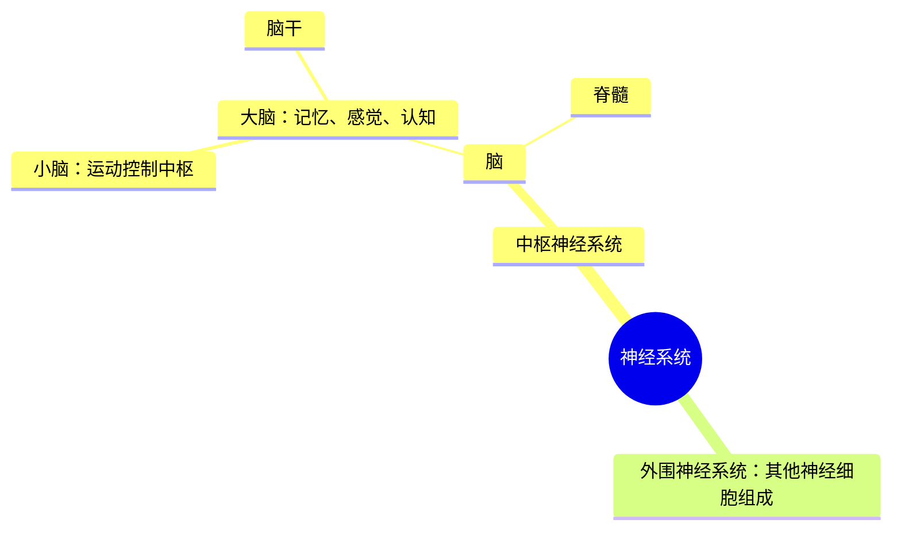

# 第1章 神经科学：过去、现在和未来

大脑（cerebrum）和小脑（cerebellum）

脑室（ventricles）

​		两种类型的脑组织：灰质（gray matter）和白质（white matter）

​		每个个体的脑表面上都可以观察到大致相同模式的隆起（称为脑回，gyri）和凹槽（称为沟和裂，sulci和fissures）（图1.8）。

这种模式使得大脑可以以叶（lobes）的形式划分并组合起来，不同的脑功能定位于不用的脑回。

​	大脑枕叶负责视觉。左额叶负责言语的产生。

​	在人体的每一根神经中都包含着许多细丝或神经纤维（nerve fiber），每一根都是一根电缆，传导不同方向的信息。

## 科学研究的步骤

+ 观察
+ 重复：排除偶然性
+ 解释
+ 验证